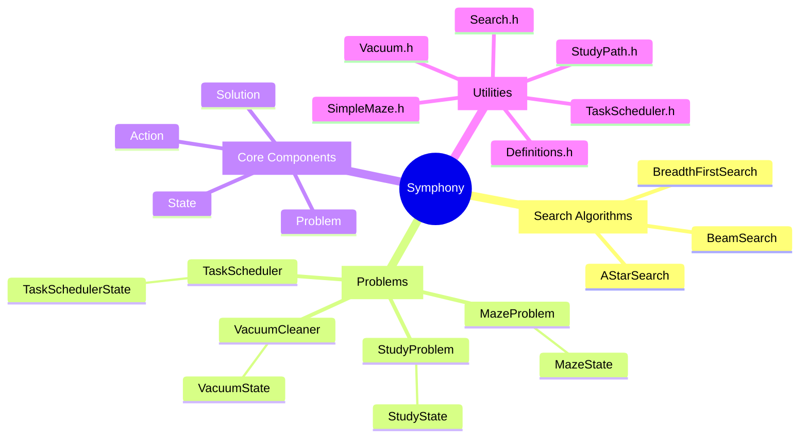

# Symphony
>  System for Yielding Multi-dimensional Problem Heuristic Optimization and Navigation

   
  

This is a C++ project focused on implementing search algorithms for rational agent problems. It provides a flexible, extensible framework for defining states, actions, and search strategies, along with example problems and test cases to ensure correctness and performance.

The inspiration is drawn from a university course on Artificial Intelligence, where students learn about rational agents, search algorithms, and problem-solving techniques. By providing a structured, modular codebase, this project aims to help students and enthusiasts understand and experiment with these concepts in a practical, hands-on way.


## Getting Started

### Prerequisites

- **C++20 Compiler**:  
  Ensure you have a modern C++ compiler that supports C++20 (e.g., `g++` >= 10 or `clang++` >= 12).

- **CMake (3.29 or newer)**:  
  Used for building the project.

- **GoogleTest Library** (optional for running tests):  
  Make sure `gtest` and `gtest_main` libraries are installed on your system, or use the provided configuration if you have them in your environment.

### Building the Project

1. **Clone the Repository**:
   ```bash
   git clone https://github.com/velocitatem/Symphony
   cd ai_rational_agents
   ```

2. **Configure and Build**:
   ```bash
   mkdir build && cd build
   cmake ..
   make
   ```

   After building, the executables will be located in the build directory:


## Extending the Project



- **Add New Problems**:  
  Create classes extending `Problem` and `State`, defining domain-specific logic, actions, and heuristics.

- **Implement Additional Search Algorithms**:  
  Extend `Search` with new search strategies (e.g., `DepthFirstSearch`, `UniformCostSearch`, `AStarSearch`) and integrate them into the problem-solving pipeline.

- **Additional Testing and CI**:  
  Add more test cases and integrate Continuous Integration (CI) to ensure code quality and maintainability.

## Contributing

Contributions are welcome! If you find issues or want to add features, feel free to:

1. Fork the repository
2. Create a new branch (`git checkout -b feature/my-feature`)
3. Commit your changes (`git commit -am 'Add my feature'`)
4. Push the branch (`git push origin feature/my-feature`)
5. Create a new Pull Request

---

**symphony** is designed to be a springboard for further exploration into rational agents, search algorithms, and AI problem-solving techniques. With its clean architecture and example-driven approach, you can quickly adapt and extend it for your own research or educational projects.
